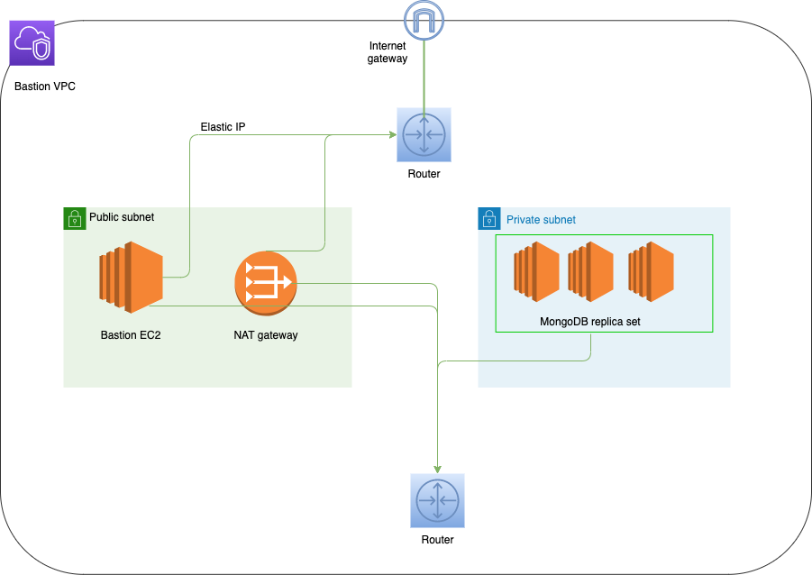

This module is part of a project to simplify the provisioning of MongoDB on AWS cloud using Terraform. You may also wish to consider [one of the other approaches](https://github.com/everest-engineering/terraform-mongodb-provisioning).

# Terraform module to provision MongoDB replica set using Packer

A terraform module to provision N-node mongodb replica set on `AWS`.

These types of resources are supported:
`EC2 instance`



### Tech

- [Terraform] - Terraform enables you to safely and predictably create, change, and improve infrastructure. It is an open source tool that codifies APIs into declarative .

### Installation

Install terraform using below documentation

`https://learn.hashicorp.com/terraform/getting-started/install.html`

### Dependencies

Before you start using this module
1. You need create mongodb AMI using [packer module](https://github.com/everest-engineering/terraform-mongodb-provisioning-packer/tree/master/packer). Provide the created AMI id for this module.
2. You need to provide the list of ebs volumes and their corresponding availability zones. Number of ebs volumes should be same as replica count.

### Provision N-node mongo replica set in private subnet.

You need to configure bastion host and pass the bastion host ip to this module to deploy the N-node replica set on the private instances.

```hcl-terraform
module "terraform-mongodb" {
  source                     = "git@github.com:everest-engineering/terraform-mongodb-provisioning-packer.git"
  replica_count              = 3
  ami                        = "ami-0091d303b9f45e661"
  instance_type              = "t2.micro"
  subnet_id                  = "subnet-eddcdzz4"
  vpc_security_group_ids     = ["sg-12345678"]
  key_name                   = "deployer-key1"
  private_key                = file("${path.module}/private-key")
  bastion_host               = "13.233.49.29"
  ssh_user                   = "ubuntu"
  tags ={
    Name = "New packer mongo"
  }
 data_volumes              = var.data_volumes
}

variable "data_volumes" {
  type                = list(object({
    ebs_volume_id     = string
    availability_zone = string
  }))
  description         = "EBS volumes list"
  default             = []
}
```
* `Note`: When you destroy the infrastrucre using `terraform destory`, it will destroy all the resources except external EBS volumes you provided.

### Examples

[Terraform-mongodb-example](examples)


### Replica set upgradation

1. Currently this module is not supporting the upgradation of replica set. Refer this [document](https://docs.mongodb.com/manual/release-notes/4.0-upgrade-replica-set/) for manual upgradation.
2. Adding new nodes to existing replica set is also not supported. You should destroy the existing infrastructure and create the new one.


### Inputs

| Name                        | Description                                             | Type   | Default      | Required |
| --------------------------- | ------------------------------------------------------- | ------ | ------------ | -------- |
| ami                         | ID of AMI to use for the instance                       | string | n/a          | yes      |
| instance_type               | The type of instance to start                           | string | n/a          | yes      |
| subnet_id                   | The VPC Subnet ID to launch in                          | string | ""           | yes      |
| vpc_security_group_ids      | A list of security group IDs to associate with          | list   | "null"       | yes      |
| key_name                    | The key name to use for the instance                    | string | ""           | yes      |
| tags                        | A mapping of tags to assign to the resource             | list   | {}           | no       |
| replica_count               | Number of nodes for replica set                         | number | 3            | yes      |
| db_admin_user               | Administrative user for managing mongo db               | string | "admin"      | no       |
| db_admin_pwd                | Administrative user password                            | string | "admin"      | no       |
| private_key                 | A private key file to provision instances               | string | ""           | yes      |
| bastion_host                | A bastion host ip to connect private instances          | string | ""           | yes      |
| ssh_user                    | SSH user name                                           | string | n/a          | yes      |

### Outputs

| Name                                 | Description                                                           |
| ------------------------------------ | --------------------------------------------------------------------  |
| instance_id_list                     | List of IDs of instances                                              |
| instance_arn_list                    | List of ARNs of instances                                             |
| instance_key_name_list               | List of key names of instances                                        |
| instance_private_ip_list             | List of private IP addresses assigned to the instances, if applicable |
| instance_security_group_list         | List of associated security groups of instances                       |
| instance_vpc_security_group_id_list  | List of associated security groups of instances                       |
| instance_subnet_id_list              | List of IDs of VPC subnets of instances                               |
| instance_tags_list                   | List of tags of instances                                             |
| instance_state_list                  | List of instance states of instances                                  |


## Testing

1. Install Go https://golang.org/doc/install.
2. Configure AWS Credentials as environment variables as mentioned above.

```shell script
> cd test
> go test -v
```

## Contributing

We appreciate your help!

[Open an issue](https://github.com/everest-engineering/terraform-mongodb-provisioning-packer/issues/new) or submit a pull request for an enhancement.
Browse through the
[current open issues](https://github.com/everest-engineering/terraform-mongodb-provisioning-packer/issues).

## License

[](https://opensource.org/licenses/Apache-2.0)

## Authors

[](https://everest.engineering)

[](https://everest.engineering)
